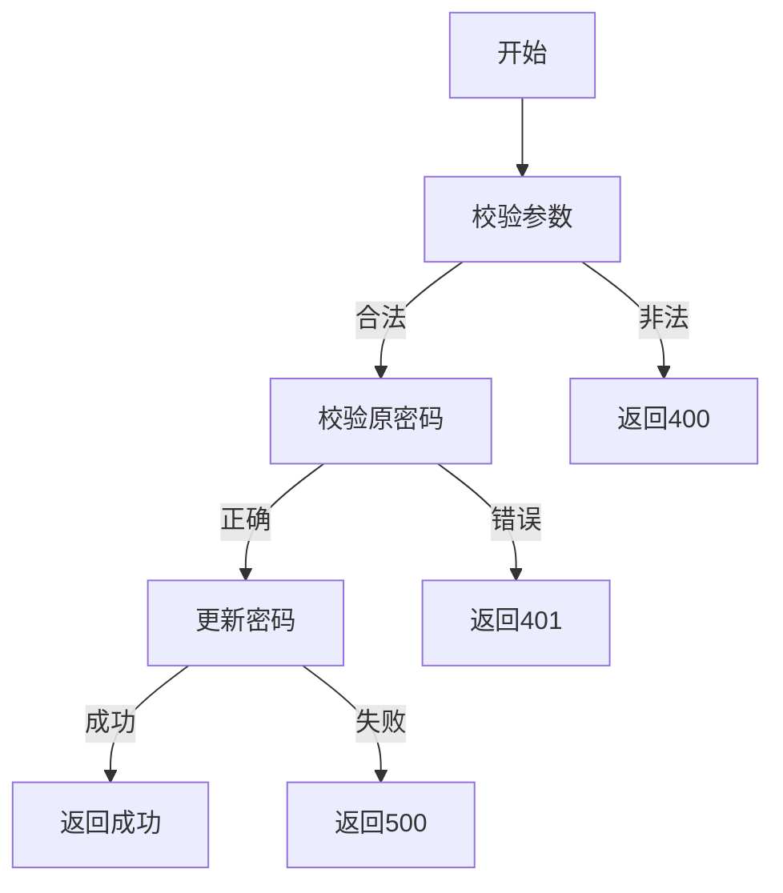

# 用户修改密码需求文档

## 1. 功能描述
用户修改密码用于已登录用户主动变更自己的登录密码。

## 2. 目标
- 支持用户安全修改密码。
- 校验原密码和新密码合法性。

## 3. 输入输出
### 输入
- 用户ID
- 原密码
- 新密码

### 输出
- 操作结果（成功/失败）

## 4. API/接口设计
| 接口 | 方法 | 路径 | 描述 |
| ---- | ---- | ---- | ---- |
| 修改密码 | POST | /api/user/v1/password/change | 用户修改密码 |

#### 请求示例
POST /api/user/v1/password/change
```json
{
  "userId": 1,
  "oldPassword": "oldpass",
  "newPassword": "newpass123"
}
```

#### 响应示例
```json
{
  "code": 0,
  "msg": "success"
}
```

## 5. 数据结构
```go
UserPasswordChangeRequest struct {
    UserID      int64  `json:"userId"`
    OldPassword string `json:"oldPassword"`
    NewPassword string `json:"newPassword"`
}
```

## 6. 异常处理
- 用户不存在：返回404，"用户不存在"
- 原密码错误：返回401，"原密码错误"
- 参数校验失败：返回400，"参数错误"
- 服务器异常：返回500，"服务器错误"

## 7. 流程图


## 8. 安全性
- 密码加密存储。
- 新密码强度校验。
- 操作需登录态。

## 9. 日志
- 记录密码修改操作。
- 记录异常和失败原因。

## 10. 测试用例
1. 正常修改密码。
2. 原密码错误，返回401。
3. 用户不存在，返回404。
4. 参数非法，返回400。
5. 服务器异常，返回500。 