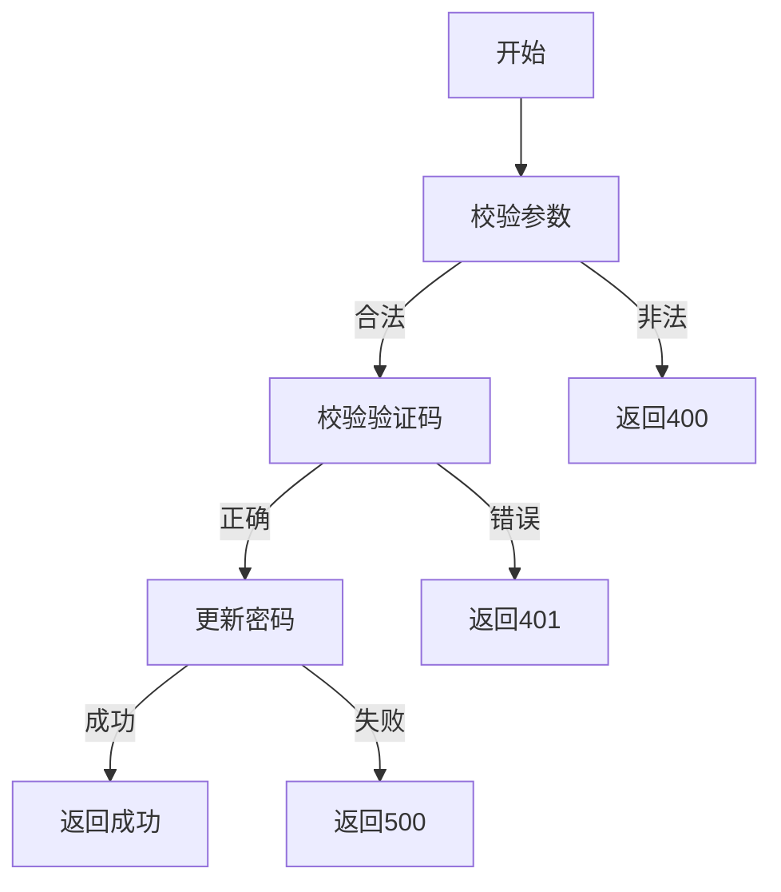

# 用户重置密码需求文档

## 1. 功能描述
用户重置密码用于管理员或用户本人在忘记密码等场景下重置登录密码。

## 2. 目标
- 支持管理员或用户本人重置密码。
- 校验身份和新密码合法性。

## 3. 输入输出
### 输入
- 用户ID
- 新密码
- 验证信息（如验证码、邮箱、手机号等）

### 输出
- 操作结果（成功/失败）

## 4. API/接口设计
| 接口 | 方法 | 路径 | 描述 |
| ---- | ---- | ---- | ---- |
| 重置密码 | POST | /api/user/v1/password/reset | 用户重置密码 |

#### 请求示例
POST /api/user/v1/password/reset
```json
{
  "userId": 1,
  "newPassword": "newpass123",
  "verifyCode": "123456"
}
```

#### 响应示例
```json
{
  "code": 0,
  "msg": "success"
}
```

## 5. 数据结构
```go
UserPasswordResetRequest struct {
    UserID     int64  `json:"userId"`
    NewPassword string `json:"newPassword"`
    VerifyCode  string `json:"verifyCode"`
}
```

## 6. 异常处理
- 用户不存在：返回404，"用户不存在"
- 验证码错误：返回401，"验证码错误"
- 参数校验失败：返回400，"参数错误"
- 服务器异常：返回500，"服务器错误"

## 7. 流程图


## 8. 安全性
- 新密码强度校验。
- 验证码机制防止滥用。
- 操作需身份校验。

## 9. 日志
- 记录密码重置操作。
- 记录异常和失败原因。

## 10. 测试用例
1. 正常重置密码。
2. 验证码错误，返回401。
3. 用户不存在，返回404。
4. 参数非法，返回400。
5. 服务器异常，返回500。 