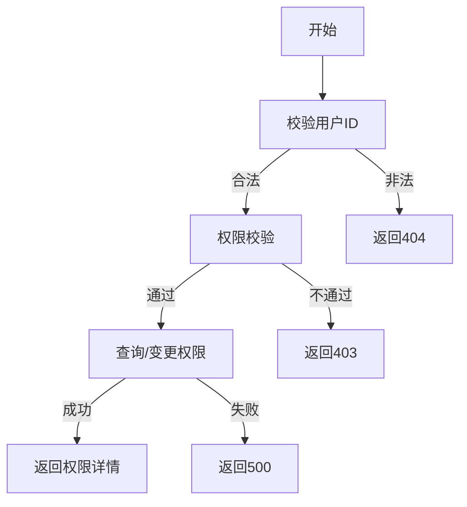

# 用户权限管理需求文档

## 1. 功能描述
用户权限管理用于为用户分配、查询、变更其在系统中的权限。

## 2. 目标
- 支持管理员为用户分配和变更权限。
- 支持查询用户权限列表。

## 3. 输入输出
### 输入
- 用户ID
- 权限列表

### 输出
- 操作结果（成功/失败）
- 用户权限详情

## 4. API/接口设计
| 接口 | 方法 | 路径 | 描述 |
| ---- | ---- | ---- | ---- |
| 查询用户权限 | GET | /api/user/v1/permission/{userId} | 查询指定用户权限 |
| 分配/变更权限 | POST | /api/user/v1/permission/{userId} | 分配或变更用户权限 |

#### 请求示例
GET /api/user/v1/permission/123
POST /api/user/v1/permission/123
```json
{
  "permissions": ["user:view", "user:edit"]
}
```

#### 响应示例
```json
{
  "code": 0,
  "msg": "success",
  "data": {
    "userId": 123,
    "permissions": ["user:view", "user:edit"]
  }
}
```

## 5. 数据结构
```go
UserPermissionRequest struct {
    Permissions []string `json:"permissions"`
}
UserPermissionResponse struct {
    UserID      int64    `json:"userId"`
    Permissions []string `json:"permissions"`
}
```

## 6. 异常处理
- 用户不存在：返回404，"用户不存在"
- 权限不足：返回403，"无权限"
- 参数校验失败：返回400，"参数错误"
- 服务器异常：返回500，"服务器错误"

## 7. 流程图


## 8. 安全性
- 仅允许有权限的管理员操作。
- 输入参数严格校验。

## 9. 日志
- 记录权限分配、变更操作。
- 记录异常和失败原因。

## 10. 测试用例
1. 查询用户权限。
2. 分配/变更权限成功。
3. 用户不存在，返回404。
4. 权限不足，返回403。
5. 参数非法，返回400。
6. 服务器异常，返回500。 