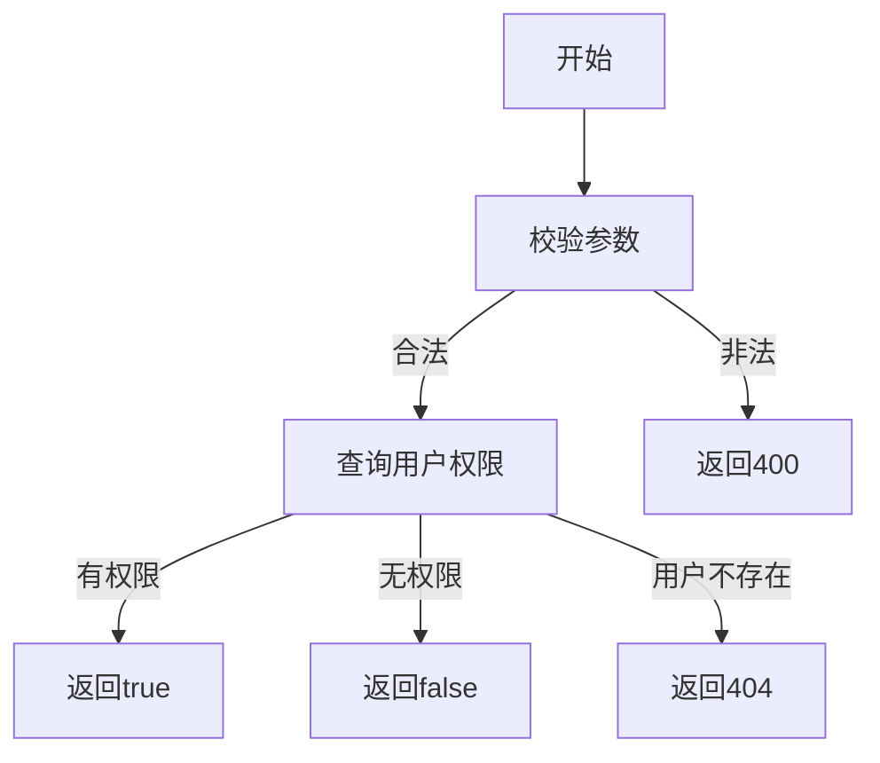

# 权限校验需求文档

## 1. 功能描述
权限校验用于在用户访问受限资源或操作时，校验其是否具备相应权限。

## 2. 目标
- 支持系统各接口统一权限校验。
- 提供灵活的权限配置与校验机制。

## 3. 输入输出
### 输入
- 用户ID
- 权限标识（如"user:edit"）

### 输出
- 校验结果（有权限/无权限）

## 4. API/接口设计
| 接口 | 方法 | 路径 | 描述 |
| ---- | ---- | ---- | ---- |
| 权限校验 | POST | /api/user/v1/permission/check | 校验用户权限 |

#### 请求示例
POST /api/user/v1/permission/check
```json
{
  "userId": 1,
  "permission": "user:edit"
}
```

#### 响应示例
```json
{
  "code": 0,
  "msg": "success",
  "data": {
    "hasPermission": true
  }
}
```

## 5. 数据结构
```go
UserPermissionCheckRequest struct {
    UserID     int64  `json:"userId"`
    Permission string `json:"permission"`
}
UserPermissionCheckResponse struct {
    HasPermission bool `json:"hasPermission"`
}
```

## 6. 异常处理
- 用户不存在：返回404，"用户不存在"
- 参数校验失败：返回400，"参数错误"
- 服务器异常：返回500，"服务器错误"

## 7. 流程图


## 8. 安全性
- 输入参数严格校验。
- 防止越权访问。

## 9. 日志
- 记录权限校验操作。
- 记录异常和失败原因。

## 10. 测试用例
1. 权限校验通过。
2. 权限校验不通过。
3. 用户不存在，返回404。
4. 参数非法，返回400。
5. 服务器异常，返回500。 