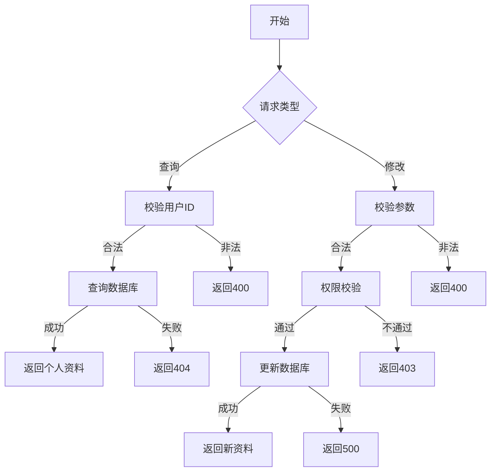

# 用户个人资料管理需求文档

## 1. 功能描述
用户个人资料管理用于用户查看和修改自己的个人资料，包括头像、昵称、个人简介等。

## 2. 目标
- 支持用户查看和修改个人资料。
- 保证数据安全性和一致性。

## 3. 输入输出
### 输入
- 用户ID
- 个人资料字段（头像、昵称、个人简介等）

### 输出
- 操作结果（成功/失败）
- 个人资料详情

## 4. API/接口设计
| 接口 | 方法 | 路径 | 描述 |
| ---- | ---- | ---- | ---- |
| 查询个人资料 | GET | /api/user/v1/profile/{userId} | 查询用户个人资料 |
| 修改个人资料 | PUT | /api/user/v1/profile/{userId} | 修改用户个人资料 |

#### 请求示例
GET /api/user/v1/profile/123
PUT /api/user/v1/profile/123
```json
{
  "nickname": "新昵称",
  "avatar": "url",
  "bio": "个人简介"
}
```

#### 响应示例
```json
{
  "code": 0,
  "msg": "success",
  "data": {
    "userId": 123,
    "nickname": "新昵称",
    "avatar": "url",
    "bio": "个人简介"
  }
}
```

## 5. 数据结构
```go
UserProfile struct {
    UserID   int64  `json:"userId"`
    Nickname string `json:"nickname"`
    Avatar   string `json:"avatar"`
    Bio      string `json:"bio"`
}
```

## 6. 异常处理
- 用户不存在：返回404，"用户不存在"
- 参数校验失败：返回400，"参数错误"
- 权限不足：返回403，"无权限"
- 服务器异常：返回500，"服务器错误"

## 7. 流程图


## 8. 安全性
- 仅允许用户本人修改个人资料。
- 输入参数严格校验。

## 9. 日志
- 记录个人资料修改操作。
- 记录异常和失败原因。

## 10. 测试用例
1. 查询个人资料成功。
2. 修改个人资料成功。
3. 用户不存在，返回404。
4. 权限不足，返回403。
5. 参数非法，返回400。
6. 服务器异常，返回500。 