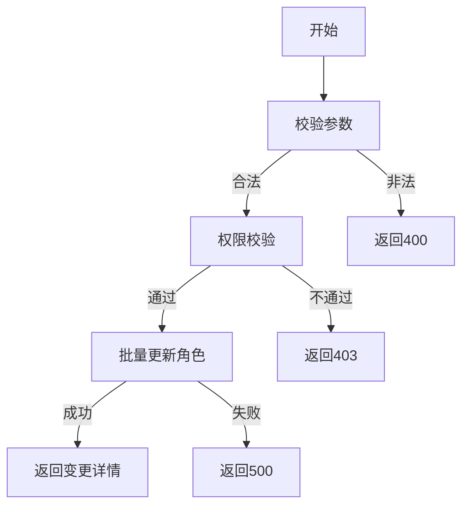

# 分配/变更用户角色需求文档

## 1. 功能描述
分配/变更用户角色用于管理员为用户分配新角色或变更现有角色。

## 2. 目标
- 支持管理员批量分配或变更用户角色。
- 校验用户和角色的合法性。

## 3. 输入输出
### 输入
- 用户ID列表
- 角色列表

### 输出
- 操作结果（成功/失败）
- 变更后用户角色详情

## 4. API/接口设计
| 接口 | 方法 | 路径 | 描述 |
| ---- | ---- | ---- | ---- |
| 批量分配/变更角色 | POST | /api/user/v1/role/assign | 批量分配或变更用户角色 |

#### 请求示例
POST /api/user/v1/role/assign
```json
{
  "userIds": [1,2,3],
  "roles": ["user"]
}
```

#### 响应示例
```json
{
  "code": 0,
  "msg": "success",
  "data": [
    {"userId": 1, "roles": ["user"]},
    {"userId": 2, "roles": ["user"]},
    {"userId": 3, "roles": ["user"]}
  ]
}
```

## 5. 数据结构
```go
UserRoleAssignRequest struct {
    UserIDs []int64  `json:"userIds"`
    Roles   []string `json:"roles"`
}
UserRoleAssignResponseItem struct {
    UserID int64    `json:"userId"`
    Roles  []string `json:"roles"`
}
```

## 6. 异常处理
- 用户不存在：返回404，"用户不存在"
- 角色不存在：返回404，"角色不存在"
- 权限不足：返回403，"无权限"
- 参数校验失败：返回400，"参数错误"
- 服务器异常：返回500，"服务器错误"

## 7. 流程图


## 8. 安全性
- 仅允许有权限的管理员操作。
- 输入参数严格校验。

## 9. 日志
- 记录角色分配、变更操作。
- 记录异常和失败原因。

## 10. 测试用例
1. 批量分配角色成功。
2. 用户不存在，返回404。
3. 角色不存在，返回404。
4. 权限不足，返回403。
5. 参数非法，返回400。
6. 服务器异常，返回500。 