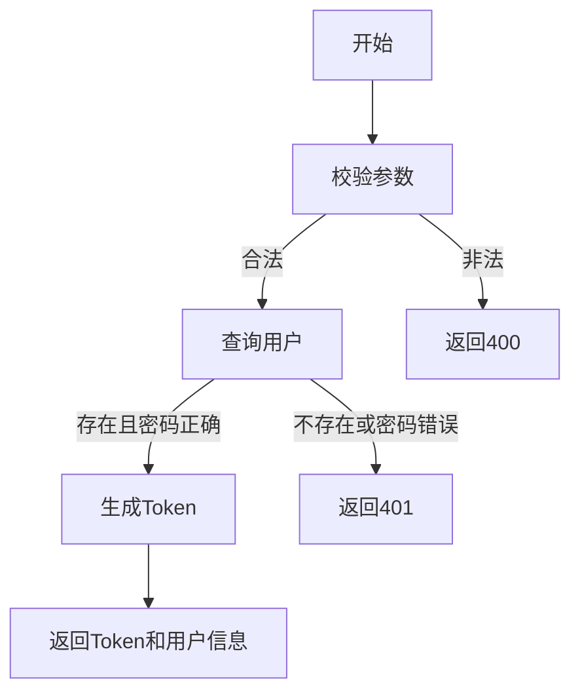

# 用户登录/登出与会话管理需求文档

## 1. 功能描述
用户登录/登出与会话管理用于实现用户身份认证、会话创建与销毁，保障系统安全访问。

## 2. 目标
- 支持用户登录、登出。
- 管理用户会话状态。
- 提供安全的认证机制。

## 3. 输入输出
### 输入
- 登录：用户名/邮箱/手机号、密码
- 登出：会话Token

### 输出
- 登录：操作结果、Token、用户信息
- 登出：操作结果

## 4. API/接口设计
| 接口 | 方法 | 路径 | 描述 |
| ---- | ---- | ---- | ---- |
| 用户登录 | POST | /api/user/v1/login | 用户登录 |
| 用户登出 | POST | /api/user/v1/logout | 用户登出 |

#### 请求示例
POST /api/user/v1/login
```json
{
  "username": "abc",
  "password": "pass1234"
}
```
POST /api/user/v1/logout
Header: Authorization: Bearer <token>

#### 响应示例
```json
{
  "code": 0,
  "msg": "success",
  "data": {
    "token": "jwt-token",
    "user": {
      "userId": 1,
      "username": "abc"
    }
  }
}
```

## 5. 数据结构
```go
UserLoginRequest struct {
    Username string `json:"username"`
    Password string `json:"password"`
}
UserLoginResponse struct {
    Token string `json:"token"`
    User  struct {
        UserID   int64  `json:"userId"`
        Username string `json:"username"`
    } `json:"user"`
}
```

## 6. 异常处理
- 用户不存在/密码错误：返回401，"认证失败"
- 参数校验失败：返回400，"参数错误"
- 服务器异常：返回500，"服务器错误"

## 7. 流程图


## 8. 安全性
- 密码加密存储与传输。
- Token机制防止伪造。
- 登录失败次数限制。

## 9. 日志
- 记录登录、登出操作。
- 记录异常和失败原因。

## 10. 测试用例
1. 正常登录。
2. 密码错误，返回401。
3. 用户不存在，返回401。
4. 参数非法，返回400。
5. 正常登出。
6. 服务器异常，返回500。 