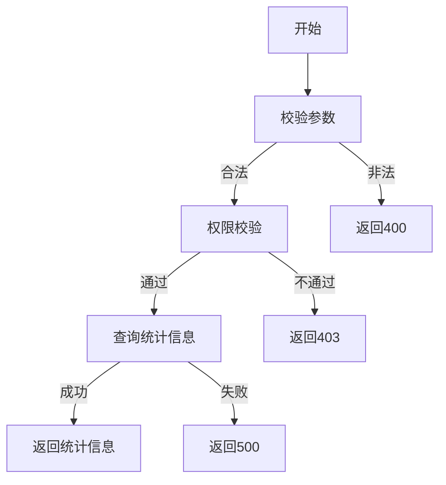

# 用户统计信息需求文档

## 1. 功能描述
用户统计信息用于统计系统中用户的各种数据，包括用户总数、活跃用户数、新增用户数等。

## 2. 目标
- 提供用户相关的统计信息。
- 支持按时间范围统计。

## 3. 输入输出
### 输入
- 时间范围
- 统计类型

### 输出
- 用户统计信息

## 4. API/接口设计
| 接口 | 方法 | 路径 | 描述 |
| ---- | ---- | ---- | ---- |
| 查询用户统计信息 | GET | /api/user/v1/statistics | 查询用户统计信息 |

#### 请求示例
GET /api/user/v1/statistics?startTime=2023-01-01&endTime=2023-12-31

#### 响应示例
```json
{
  "code": 0,
  "msg": "success",
  "data": {
    "totalUsers": 1000,
    "activeUsers": 800,
    "newUsers": 100,
    "loginCount": 5000
  }
}
```

## 5. 数据结构
```go
UserStatistics struct {
    TotalUsers  int `json:"totalUsers"`
    ActiveUsers int `json:"activeUsers"`
    NewUsers    int `json:"newUsers"`
    LoginCount  int `json:"loginCount"`
}
```

## 6. 异常处理
- 参数校验失败：返回400，"参数错误"
- 权限不足：返回403，"无权限"
- 服务器异常：返回500，"服务器错误"

## 7. 流程图


## 8. 安全性
- 仅允许有权限的用户查询。
- 防止敏感信息泄露。

## 9. 日志
- 记录统计信息查询操作。
- 记录异常和失败原因。

## 10. 测试用例
1. 正常查询用户统计信息。
2. 按时间范围统计。
3. 参数非法，返回400。
4. 权限不足，返回403。
5. 服务器异常，返回500。 