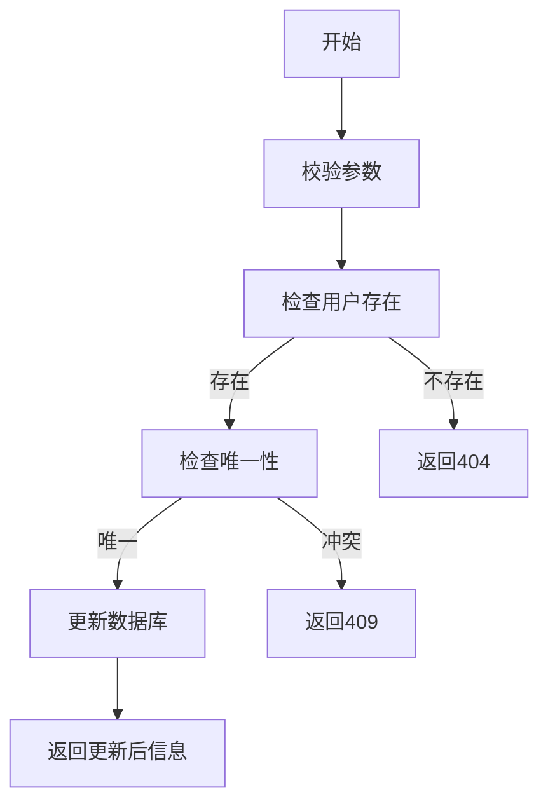

# 用户信息更新功能需求文档

## 1. 功能描述
用户信息更新功能用于修改用户的基础信息、扩展资料、角色和权限，支持管理员和用户本人操作，保障数据一致性和安全。

## 2. 功能目标
- 支持用户本人和管理员更新信息
- 校验唯一性和格式
- 支持部分字段更新和批量更新
- 响应时间≤2秒，批量≤30秒/百人
- 更新成功率≥99.9%

## 3. 输入输出
### 输入参数
- 用户ID、待更新字段（如邮箱、手机号、昵称、头像、角色等）

#### 请求示例
```json
{
  "userId": 124,
  "email": "new@email.com",
  "phone": "12345678901",
  "profile": {"nickname": "新昵称"}
}
```

### 输出结果
- 操作结果（成功/失败）
- 更新后用户信息

#### 响应示例
```json
{
  "code": 0,
  "msg": "success",
  "data": {
    "userId": 124,
    "email": "new@email.com"
  }
}
```

## 4. 接口设计
### RESTful API
| 接口 | 方法 | 路径 | 描述 |
| ---- | ---- | ---- | ---- |
| 更新用户 | POST | /api/user/v1/update | 更新用户信息 |
| 批量更新 | POST | /api/user/v1/batch-update | 批量更新用户 |

## 5. 数据结构
### Go结构体
```go
type UserUpdateRequest struct {
    UserID  int64   `json:"userId" validate:"required"`
    Email   string  `json:"email,omitempty" validate:"omitempty,email"`
    Phone   string  `json:"phone,omitempty" validate:"omitempty,len=11"`
    Profile *Profile `json:"profile,omitempty"`
}
type UserUpdateResponse struct {
    UserID int64 `json:"userId"`
    Email  string `json:"email"`
}
```

## 6. 异常处理
- 用户不存在：404 Not Found
- 参数校验失败：400 Bad Request
- 权限不足：403 Forbidden
- 唯一性冲突：409 Conflict
- 服务器异常：500 Internal Server Error

## 7. 流程图


## 8. 安全性考虑
- 仅允许本人或管理员操作
- 严格校验输入参数
- 操作日志审计
- 防止越权修改

## 9. 日志与监控
- 记录用户更新操作、失败原因、来源IP
- 监控更新成功率、异常率、响应时间
- 告警：更新失败率>5%时通知运维

## 10. 测试用例
1. 正常更新用户信息
2. 用户不存在，返回404
3. 邮箱/手机号冲突，返回409
4. 参数非法，返回400
5. 权限不足，返回403
6. 服务器异常，返回500
7. 批量更新部分失败
8. 操作日志校验 