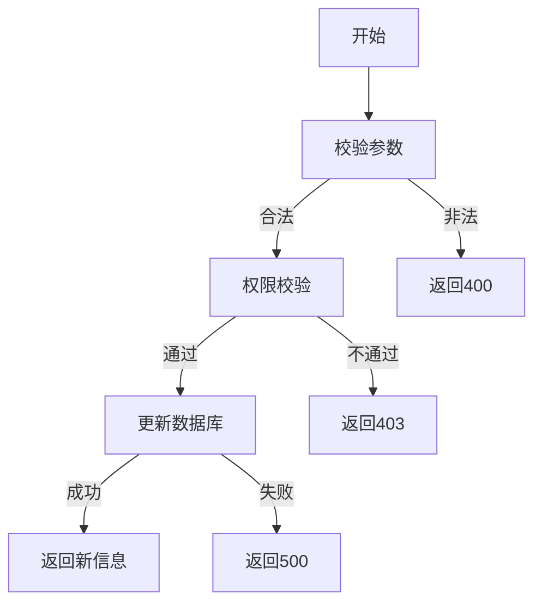

# 更新用户信息需求文档

## 1. 功能描述
更新用户信息用于修改系统中已存在用户的基础资料，包括用户名、邮箱、手机号、头像、状态等。

## 2. 目标
- 支持管理员或用户本人更新用户信息。
- 校验输入信息合法性。

## 3. 输入输出
### 输入
- 用户ID
- 可更新字段（用户名、邮箱、手机号、头像、状态等）

### 输出
- 操作结果（成功/失败）
- 更新后用户信息

## 4. API/接口设计
| 接口 | 方法 | 路径 | 描述 |
| ---- | ---- | ---- | ---- |
| 更新用户信息 | PUT | /api/user/v1/update/{userId} | 更新指定用户信息 |

#### 请求示例
PUT /api/user/v1/update/123
```json
{
  "username": "newname",
  "email": "new@email.com",
  "phone": "12345678901",
  "avatar": "url",
  "status": 1
}
```

#### 响应示例
```json
{
  "code": 0,
  "msg": "success",
  "data": {
    "userId": 123,
    "username": "newname",
    "email": "new@email.com",
    "phone": "12345678901",
    "avatar": "url",
    "status": 1
  }
}
```

## 5. 数据结构
```go
UserUpdateRequest struct {
    Username string `json:"username"`
    Email    string `json:"email"`
    Phone    string `json:"phone"`
    Avatar   string `json:"avatar"`
    Status   int    `json:"status"`
}
UserUpdateResponse struct {
    UserID   int64  `json:"userId"`
    Username string `json:"username"`
    Email    string `json:"email"`
    Phone    string `json:"phone"`
    Avatar   string `json:"avatar"`
    Status   int    `json:"status"`
}
```

## 6. 异常处理
- 用户不存在：返回404，"用户不存在"
- 参数校验失败：返回400，"参数错误"
- 权限不足：返回403，"无权限"
- 服务器异常：返回500，"服务器错误"

## 7. 流程图


## 8. 安全性
- 仅允许有权限的用户或本人更新。
- 输入参数严格校验。

## 9. 日志
- 记录用户信息更新操作。
- 记录异常和失败原因。

## 10. 测试用例
1. 正常更新用户信息。
2. 用户不存在，返回404。
3. 参数非法，返回400。
4. 权限不足，返回403。
5. 服务器异常，返回500。 